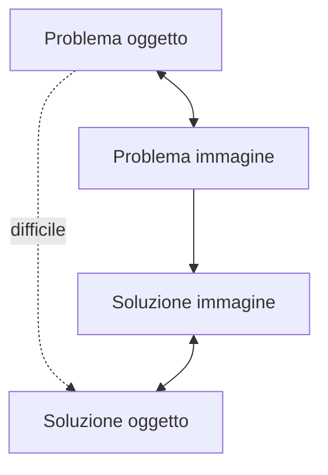

Sia $f$ una funzione $f: \mathbb R \longmapsto \mathbb C$  (per noi saranno *segnali di ingresso, uscita di sistemi dinamici*)

$$
F(s) = \int_{0^-}^{+\infty}{f(t) e^{-st} dt}
$$
se esiste per qualche $s$, ovvero se **l'integrale converge**.

> [!tip]
> Se non ci fosse la $e^{-st}$, l'integrale mi darebbe un numero.
>
> Se lo moltiplico per $e^{-st}$, per ogni valore di $s$ ottengo un nuovo integrale con un altro risultato. Quindi al cambiamento di $s$ cambia il risultato $F(s)$.

#### Notazione
Trasformazione di Laplace $\mathcal L\qquad f(t) \overset{\mathcal L}{\longrightarrow} F(s)$
$F(s) = \mathcal L[f(t)]$

#### Osservazione
L'$e^{-st}$ *garantisce* un po' la convergenza dell'integrale per un po' di più di funzioni.

$$
e^{-st} = e^{-\sigma t} \underbrace{e^{-j\omega t}}_{\text{converge}}
$$
#### Osservazione: ascissa di convergenza
Sia $\overline\sigma > −\infty$ estremo inferiore di $s = \sigma + j\omega$ per cui l’integrale converge.

Allora trasformata esiste nel semipiano $Re(s)> \overline\sigma$.
$$\overline\sigma \quad \text{ascissa di convergenza}$$
[[CAT_parte3_2023_10_16.pdf#page=4&selection=3,0,36,22|CAT_parte3_2023_10_16, page 4]]

### Osservazione: trasformate razionali

Le trasformate con cui lavoreremo saranno quasi sempre **rapporti di polinomi primi tra loro**.
$$
F(s) = \frac {N(s)}{D(s)}
$$
con $N(s), D(s)$ polinomi primi tra loro.

### Zeri e poli della trasformata razionale
- **Zeri**: Radici di $N(s)$
- **Poli**: Radici di $D(s)$

>[!info] Nota
>Poichè vedremo che i **coefficienti** dei polinomi $N(s)$ e $D(s)$ saranno **reali**, allora avremo **zeri e poli**
>- *reali* o
>- *complessi coniugati*

Esempio: *vedi onenote*

### Antitrasformata
$$
f(t) = \frac 1 {2\pi j} \int_{\sigma-j\infty}^{\sigma+j\infty}{F(s) \ e^{st} \ ds}
$$

con $\sigma > \overline \sigma$

##### Notazione
Antitrasformata di Laplace $\mathcal L^{-1} \qquad F(s) \overset{\mathcal L^{-1}}\longrightarrow f(t)$

> [!tip] Nota
> Si assume $f(t) = 0$ per $t < 0$.
>
> Sotto questa ipotesi c'è una corrispondenza biunivoca tra $f(t)$ e $F(s)$.

## Perchè la trasformata di Laplace?

## Proprietà
### Proprietà di linearità

$$
\mathcal L[\alpha f(t) + \beta g(t)] = \alpha\mathcal L[f(t)]
+ \beta\mathcal L[g(t)] = \alpha F(s) + \beta G(s) \qquad \forall \alpha,\beta \in \mathbb C
$$

*Vedi onenote per dimostrazione*

### Traslazione temporale

$$
\mathcal L[f(t-\tau)] = e^{-\tau s} F(s) \qquad \forall \tau > 0
$$

*Vedi onenote per dimostrazione*
### Traslazione nel dominio della variabile complessa

$$
\mathcal L[e^{\alpha t} f(t)] = F(s-\alpha) \quad \forall \alpha \in \mathbb C
$$

*Vedi onenote per dimostrazione*

### Derivazione nel tempo

$$
\begin{aligned}
&\mathcal L \left[ \frac d {dt} f(t) \right] = sF(s) - f(0) \\&
\mathcal L \left[ \frac {d^n} {dt^n} f(t) \right] = s^n F(s) - \sum_{i=1}^n s^{n-i} \frac {d^{i-1}}{dt^{i-1}} f(t)|_{t=0}
\end{aligned}
$$

*Vedi onenote per dimostrazione*
### Integrazione (nel tempo)
$$
\mathcal L\left[ \int_0^tf(\tau)d\tau\right] = \frac 1 s F(s)
$$
### Convoluzione (nel tempo)

$$
\mathcal L \left[ \int_0^t f_1(t-\tau)f_2(\tau) \ d\tau \right] = F_1(s) \cdot F_2(s)
$$

### Teorema del valore iniziale
**Ipotesi:**
Sia $f(t) \in \mathbb R$  una funzione del tempo con
- trasformata razionale $F(s) = \frac{N(Ss)}{D(s)}$
- $\text{grado}\{D(s)\} > \text{grado}\{N(s)\}$

**Tesi:**
$$
f(0) = \lim_{s \to \infty}sF(s)
$$
La funzione per $t = 0$ si comporta come $sF(s), s \to \infty$.

### Teorema del valore finale
**Ipotesi:**
Sia $f(t) \in \mathbb R$ una funzione del tempo con
- trasformata razionale $F(s) = \frac{N(Ss)}{D(s)}$
- $\text{grado}\{D(s)\} > \text{grado}\{N(s)\}$
- poli (radici di $D(s)$) nulli o a parte reale negativa

**Tesi:**
$$
\lim_{t\to \infty}f(t) = \lim_{s\to 0} sF(s)
$$
La funzione per $t \to \infty$ si comporta come $sF(s), s \to 0$.

### Trasformata di segnali elementari

*Vedi slides*

> [!warning] Attenzione
> Se prendo $sin(\omega t - \frac \pi 2)$ , devo considerare anche $1(t-\frac \pi 2)$, altrimenti non va bene.
>
> *Vedi onenote per grafico*

*Next: [[3.3 - Funzione di trasferimento]]*
